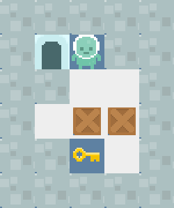
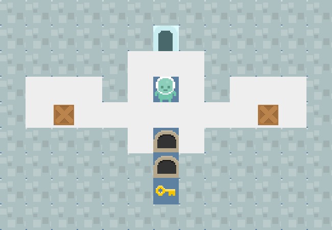
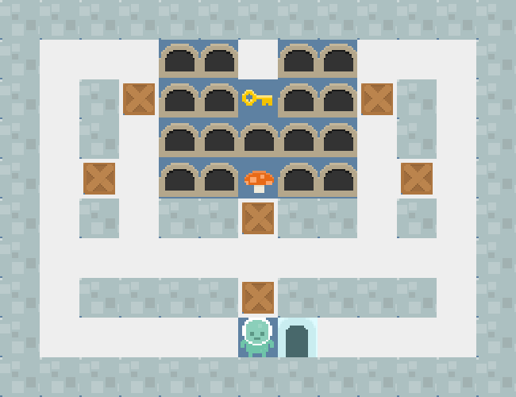
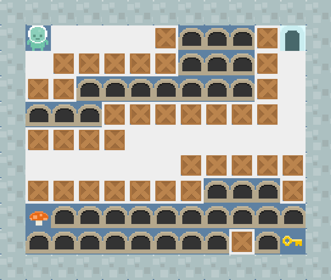
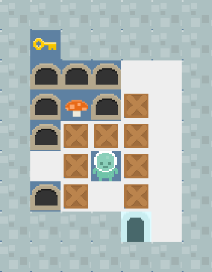

# Description

AI homework.

## Assignment 1

gvgai-bait: https://github.com/EssexUniversityMCTS/gvgai 

### Task 1: Depth First Search

Description: Use DFS. No depth and time limit.

|         | Win/Lose | Score | Time Step |
|---------|----------|-------|-----------|
| Level 0 | Win      | 5     | 9         |
| Level 1 | Win      | 7     | 98        |
| Level 2 | Win      | 11    | 261       |
| Level 3 | Lose     | 0     | 1000      |
| Level 4 | Win      | 11    | 61        |
| Summary | 4:1      | 34    | 429       |

### Task 2: Heuristic Depth Limited Search

Description: Use a heuristic function to guide avatar. It has to make a decision when time is up.

|         | Win/Lose | Score | Time Step |
|---------|----------|-------|-----------|
| Level 0 | Win      | 5     | 9         |
| Level 1 | Win      | 7     | 205       |
| Level 2 | Win      | 7     | 124       |
| Level 3 | Lose     | 0     | 1000      |
| Level 4 | Win      | 11    | 549       |
| Summary | 4:1      | 30    | 887       |

### Task 3: A* Search

Description: f = g + h. It has to make a decision when time is up.

|         | Win/Lose | Score | Time Step |
|---------|----------|-------|-----------|
| Level 0 | Win      | 5     | 9         |
| Level 1 | Win      | 7     | 38        |
| Level 2 | Win      | 11    | 155       |
| Level 3 | Lose     | 7     | 1000      |
| Level 4 | Win      | 11    | 72        |
| Summary | 4:1      | 41    | 274       |

### Records

Algoritm: DFS, DLS and A\* respectively.

Level 0:

Level 1:

Level 2:

Level 3:

Level 4:

